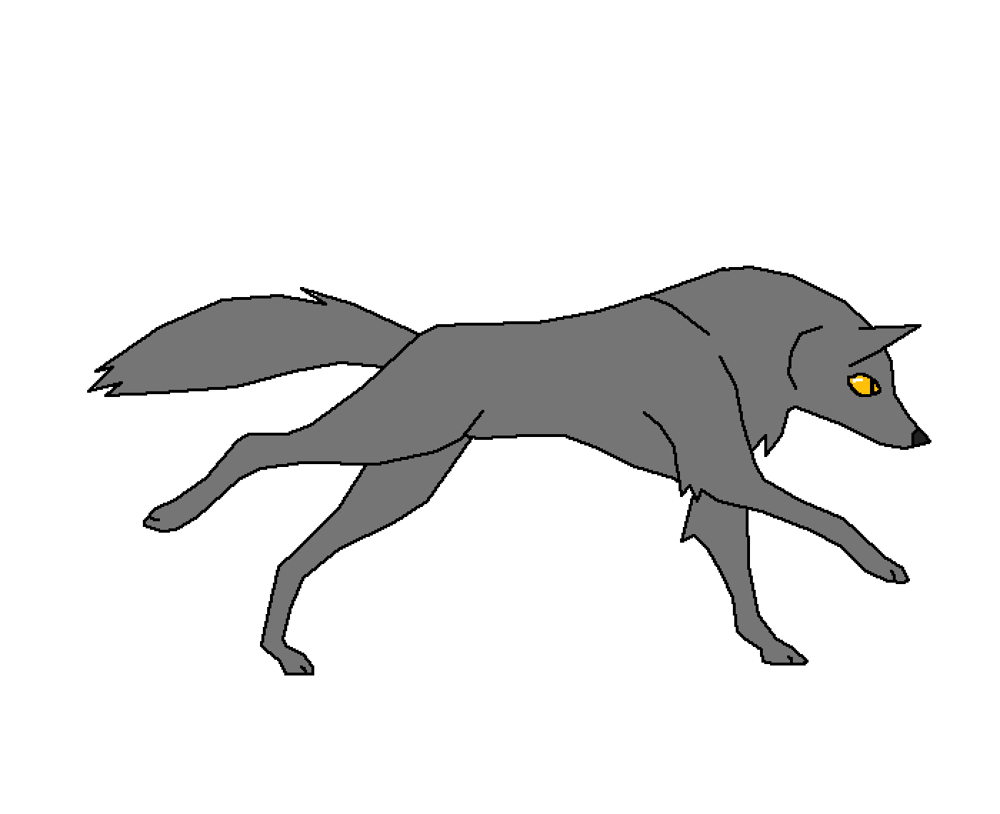

  
  
<!--    -->
  
  
  
  
  

#  Hey, I'm Kaushik Jadhav  
&nbsp;

## 🔗 Links

### Watch my contribution graph get eaten by the snake 🐍

<!-- platane/snk works, it just puts it on a new branch -->

## 🚀 About Me

  I am a Full Stack Developer with 3.5 yrs of engineering experience specializing in Backend, Dev-Ops and Cloud. I like doing cool things like exploring recent tools in the software industry, writing technical articles on Medium and participating in coding competitions. I have hands-on experience in developing large scale production level apps and my managers have always appreciated me for things like writing “efficient code”, taking ownership of other team's tasks and introducing new processes that helped achieve quality results faster.

<ul>
<li/>I like to use my skills to support my team by automating existing manual processes or introducing new ones.</li>
<li/>I enjoy constantly improving my knowledge base by exploring new tools or collaborating with other developers. This often facilitates ideas and discussions that have a significant impact on my team’s objectives.</li>
<li/>I am a curiosity driven individual and a fast learner.</li>
<li/>Applying my engineering skills to solve real life problems excites me.</li>
</ul>

## 🏅 Achievements

-    🥇 **Received #1 and #2 prizes** in hackathons held at **IIT Bombay** TechFest
-    📜 **40+ certifications** from various learning platforms like _LinkedIn, Udemy, Coursera_
-    👩🏼‍💻 **50+ project repos** in _Github_
-    📝 **10+ articles** in _Medium_ and _Dev_

## 📕 Publications

-    📰 **Predicting NASDAQ and NSE Stocks using Machine Learning Algorithms: ARIMA, LSTM & Linear Regression**
_IJRASET 2020 (03/2020)_
-    📰 **Flask App for Real Time Sentiment Analysis of Tweets on NASDAQ and NSE Stocks**
_IJRASET 2020 (03/2020)_
-    📰 **Building and Hosting a Computer Vision API on AWS using an EC2 instance**
_ELSEVIER 2019 (12/2019)_
-    📰 **Implementation of private cloud based collaboration platforms: AWS Amazon VPC and own Cloud**
_IJIRSET 2019 (08/2019)_
-    📰 **Wireless Sensors in IoT based Smart Restaurant**
_JASC 2019 (06/2019)_

## 🛠️ Skills

### Languages

### Front-End Development

### Back-End Development

### Mobile App Development

### Database

### DevOps

### Backend as a Service (BaaS)

### Design Tools

### Testing

