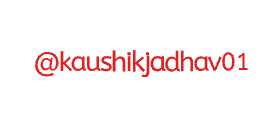

  
  
<!--    -->
  
  
  
  
  

#  Hey, I'm Kaushik Jadhav 

   

## 🚀 About Me

  I am a Full Stack Developer with 3.2 yrs of engineering experience specializing in Backend, Dev-Ops and Cloud. I like doing cool things like exploring recent innovations in the software industry, writing technical articles on Medium and participating in coding competitions. I have hands-on experience in developing large scale production level apps and my managers have always appreciated me for things like writing “efficient code”, taking ownership of other team's tasks and introducing new processes that helped achieve quality results faster.

<ul>
<li/>I like to use my skills to support my team by automating existing manual processes or introducing new ones.</li>
<li/>I enjoy constantly improving my knowledge base by exploring new tools or collaborating with other developers. This often facilitates ideas and discussions that have a significant impact on my team’s objectives.</li>
<li/>I am a curiosity driven individual and a fast learner.</li>
<li/>Being an INFJ, I am a rare mix of emotions + rationality. I can “connect” with people really well and help them likewise.</li>
<li/>Applying my engineering skills to solve real life problems excites me.</li>
</ul>
